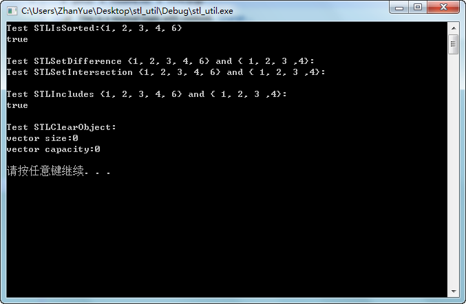

看了这边文章《
[跟Google学写代码--Chromium/base--stl_util源码学习及应用](http://blog.csdn.net/wangshubo1989/article/details/53558617)》，刚好硬盘上有谷歌浏览器的源码，上传一下。

D:\chrome_build\src\third_party\webrtc\system_wrappers\include\stl_util.h

-

